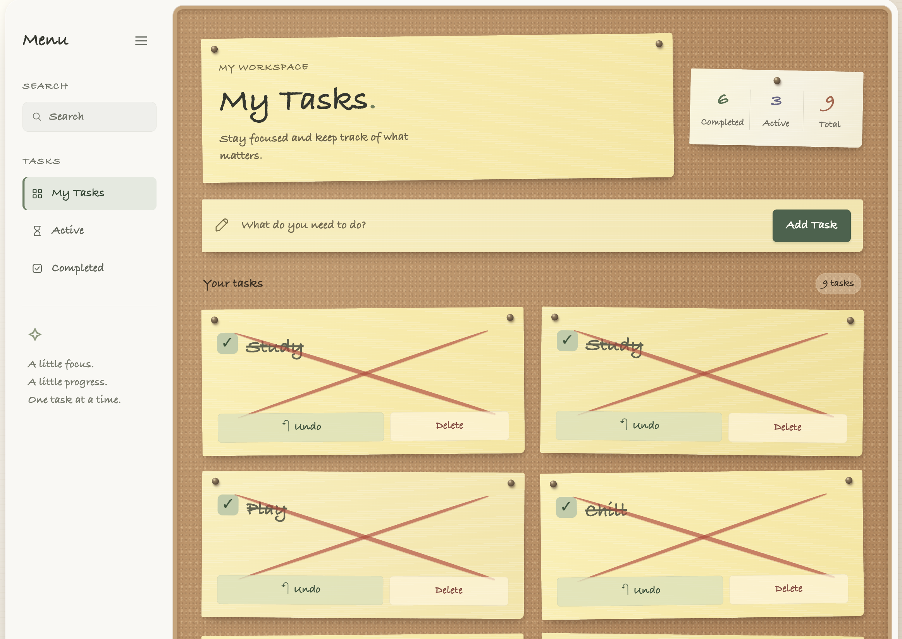

# CloudTask ☁️

A serverless task management application built on AWS with secure authentication, Infrastructure as Code, CI/CD, monitoring, and separate development and production environments.

CloudTask combines a lightweight sticky-wall task interface with a production-style AWS architecture. Users can securely sign in, create and manage their own tasks, search and filter them, and access the application through a CloudFront-delivered frontend.

> Built as a hands-on cloud engineering project focused on AWS, Terraform, DevOps, security, and serverless architecture.

---

## Application Preview



---

## Overview

CloudTask is built around a fully serverless architecture:

```text
                         User
                           │
                           ▼
                      CloudFront
                           │
                           ▼
                    Private S3 Bucket
                    (Static Frontend)
                           │
                           ▼
                      API Gateway
                           │
                    JWT Authorization
                           │
                 ┌─────────┴─────────┐
                 │                   │
                 ▼                   ▼
              Cognito              Lambda
                                      │
                                      ▼
                                  DynamoDB
```

**Supporting infrastructure**

```text
GitHub Actions ── OIDC ──► AWS
       │
       └── Terraform

Lambda ──► CloudWatch ──► SNS Alerts
```

For a more detailed architecture breakdown, see [`docs/architecture.md`](docs/architecture.md).

---

## Highlights

- Serverless AWS architecture
- Cognito authentication with OAuth 2.0 Authorization Code Flow + PKCE
- JWT-protected API Gateway endpoints
- User-isolated task data in DynamoDB
- Private S3 frontend delivered through CloudFront
- Infrastructure managed with Terraform
- GitHub Actions CI/CD using AWS OIDC
- No long-lived AWS credentials stored in GitHub
- Separate DEV and PROD environments
- Protected production deployments with manual approval
- Automated frontend and backend deployment workflows
- CloudWatch logging, metrics, alarms, and SNS notifications
- Responsive corkboard-inspired task management interface

---

## Application

The frontend uses a physical sticky-wall concept while keeping the interface simple and responsive.

Users can:

- Create and delete tasks
- Mark tasks as completed and undo completion
- Search tasks locally
- Filter between all, active, and completed tasks
- View live task statistics
- Collapse the sidebar for a focused workspace
- Securely sign in and out through Amazon Cognito

Completed tasks are visually crossed out on their sticky notes, while active tasks remain visible on the corkboard workspace.

---

## Tech Stack

| Area | Technologies |
|---|---|
| Frontend | HTML, CSS, JavaScript |
| Backend | Python, AWS Lambda |
| API | Amazon API Gateway |
| Authentication | Amazon Cognito, OAuth 2.0 PKCE, JWT |
| Database | Amazon DynamoDB |
| Hosting | Amazon S3, Amazon CloudFront |
| Infrastructure | Terraform |
| CI/CD | GitHub Actions, AWS OIDC |
| Monitoring | Amazon CloudWatch, Amazon SNS |
| Security | AWS IAM, OAC, JWT authorization |

---

## Infrastructure as Code

The AWS infrastructure is managed with Terraform rather than being maintained manually.

Terraform provisions and manages the core application infrastructure, including:

```text
CloudFront + S3
       │
       ├── Cognito
       ├── API Gateway
       ├── Lambda
       ├── DynamoDB
       └── CloudWatch + SNS
```

Remote Terraform state is stored in Amazon S3.

Infrastructure changes are validated before deployment:

```text
terraform fmt
      ↓
terraform init
      ↓
terraform validate
      ↓
terraform plan
      ↓
Terraform Apply
```

This keeps the AWS infrastructure reproducible and reviewable through code.

---

## CI/CD

CloudTask uses GitHub Actions for infrastructure validation and application deployment.

### Development

New changes are tested against the DEV environment first.

```text
Code Change
     ↓
GitHub
     ↓
DEV Deployment
     ↓
Testing
```

### Production

After DEV verification, production deployments pass through a protected GitHub Environment.

```text
DEV Verified
     ↓
Production Deployment
     ↓
Manual Approval
     ↓
AWS Production
```

GitHub Actions authenticates to AWS through **OpenID Connect (OIDC)** and assumes dedicated IAM roles. This avoids storing permanent AWS access keys in GitHub.

Separate deployment roles are used for:

- Terraform CI
- Terraform Apply
- Frontend deployment
- Backend deployment

---

## DEV and PROD Environments

CloudTask maintains isolated development and production resources.

```text
                CloudTask
                    │
           ┌────────┴────────┐
           │                 │
           ▼                 ▼
          DEV               PROD
           │                 │
     Test changes       Live application
           │                 │
     No approval       Approval required
```

Application and infrastructure changes can therefore be tested safely before reaching production.

---

## Security

Security is built into the architecture:

- S3 public access is blocked
- CloudFront accesses S3 through Origin Access Control
- API endpoints require Cognito JWT authentication
- OAuth 2.0 Authorization Code Flow with PKCE is used for authentication
- Users can only access their own task data
- Lambda uses IAM roles for AWS service access
- GitHub Actions uses temporary AWS credentials through OIDC
- CI and deployment responsibilities use separate IAM roles
- Production deployments require explicit approval
- Terraform state and local environment files are excluded from Git

---

## Monitoring

The backend is monitored through Amazon CloudWatch.

CloudTask includes:

- Lambda application logs
- Lambda error monitoring
- Lambda duration monitoring
- Lambda throttling monitoring
- API Gateway 5XX monitoring
- CloudWatch dashboard
- SNS alert notifications

```text
Lambda / API Gateway
        │
        ▼
    CloudWatch
        │
        ▼
      Alarms
        │
        ▼
       SNS
```

---

## Project Structure

```text
cloudtask-aws/
│
├── frontend/
│   ├── index.html
│   ├── app.js
│   ├── config.js
│   └── style.css
│
├── backend/
│   ├── lambda_function.py
│   ├── requirements.txt
│   └── tests/
│       └── test_lambda.py
│
├── infrastructure/
│   ├── provider.tf
│   ├── variables.tf
│   ├── locals.tf
│   ├── outputs.tf
│   ├── dynamodb.tf
│   ├── iam.tf
│   ├── lambda.tf
│   ├── api_gateway.tf
│   ├── cognito.tf
│   ├── s3.tf
│   ├── cloudfront.tf
│   └── cloudwatch.tf
│
├── .github/
│   └── workflows/
│       ├── terraform-ci.yml
│       ├── terraform-apply.yml
│       ├── terraform-dev.yml
│       ├── terraform-dev-apply.yml
│       ├── frontend-deploy.yml
│       ├── frontend-deploy-dev.yml
│       ├── backend-deploy.yml
│       └── backend-deploy-dev.yml
│
├── docs/
│   ├── architecture.md
│   └── images/
│       └── cloudtask-dashboard.png
│
└── README.md
```

---

## What I Learned

CloudTask started as a practical AWS learning project and evolved into an end-to-end serverless application.

The project provided hands-on experience with:

- Designing serverless AWS architectures
- Infrastructure as Code with Terraform
- IAM permissions and role separation
- OAuth, PKCE, JWT, and Cognito authentication
- API Gateway and Lambda integration
- DynamoDB data modeling and user isolation
- Private S3 hosting with CloudFront
- GitHub Actions CI/CD
- AWS authentication through OIDC
- DEV/PROD environment separation
- Production deployment protection
- CloudWatch monitoring and alerting

The goal was not only to deploy an application, but to understand how cloud infrastructure, security, authentication, monitoring, and CI/CD work together.

---

## Future Improvements

Possible next steps:

- Custom domain with Route 53
- ACM-managed TLS certificate
- Automated integration and end-to-end tests
- Further IAM permission tightening
- Additional application observability
- Task due dates, categories, and tags

---

## Status

CloudTask is deployed and tested across separate DEV and PROD environments.

Core application functionality, authentication, task persistence, CI/CD, infrastructure provisioning, monitoring, and production deployment protection are operational.