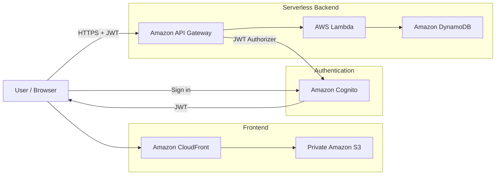
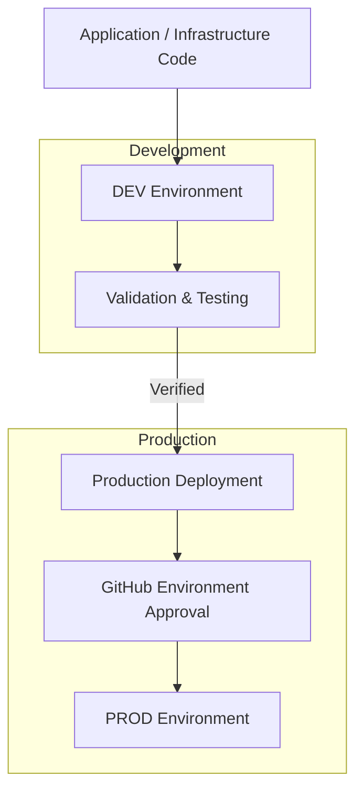
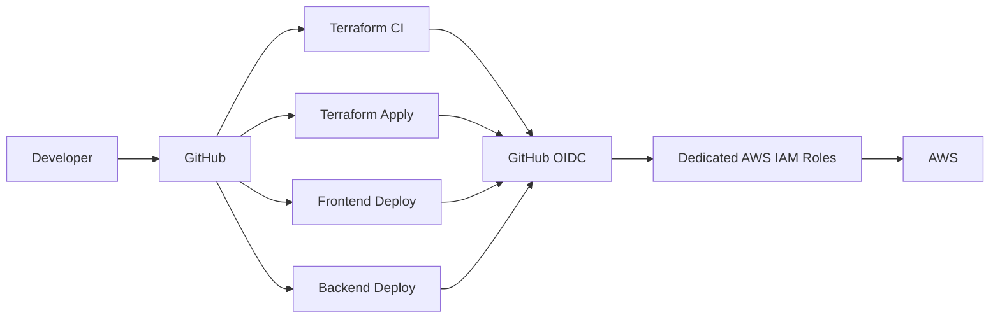
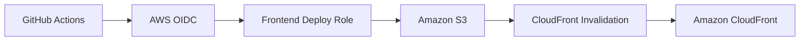
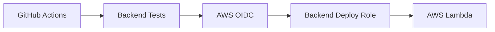
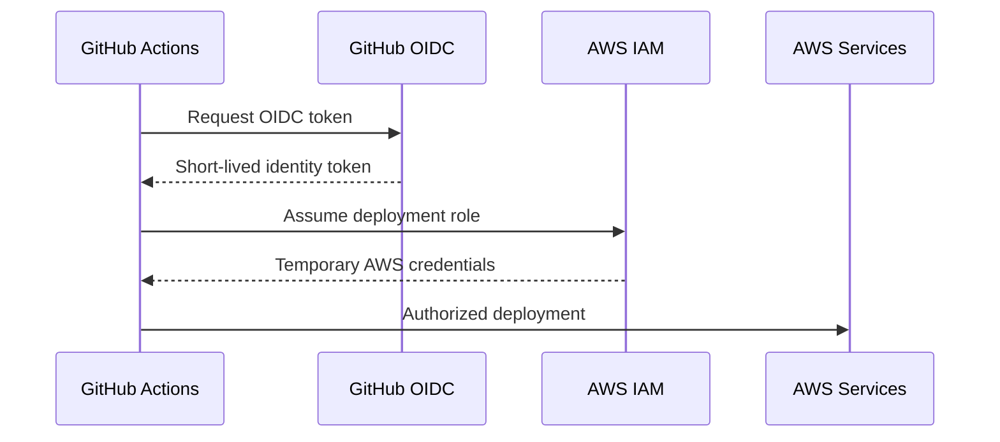
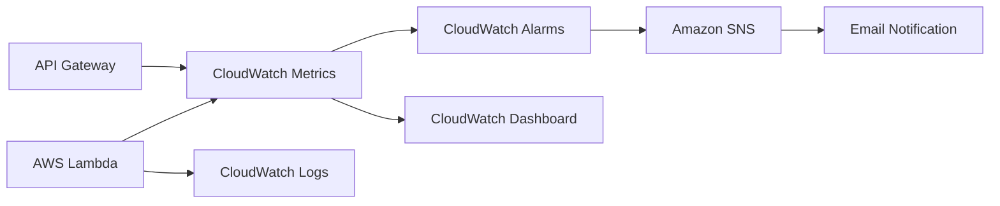
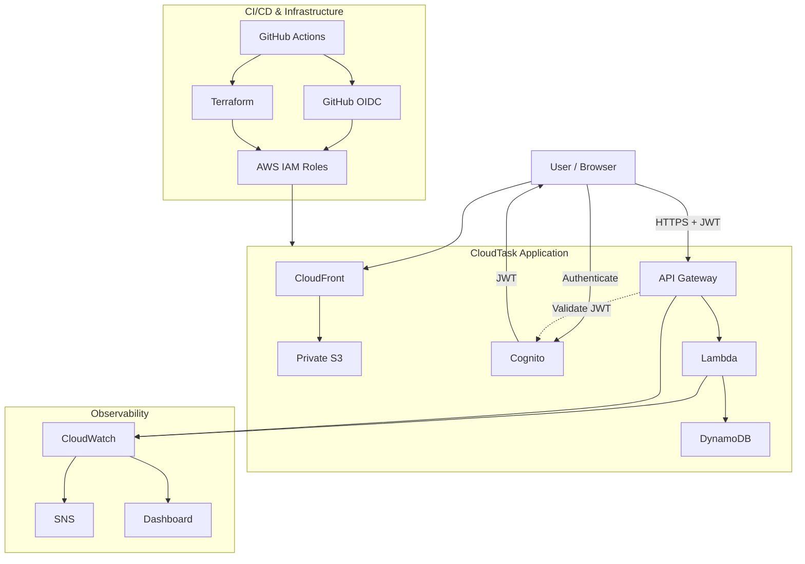

# CloudTask AWS Architecture

CloudTask uses a serverless AWS architecture with separate development and production environments, secure authentication, Infrastructure as Code, CI/CD, and integrated monitoring.

## Application Architecture



### Request Flow

```text
Browser
   │
   ├── Authentication ──► Cognito
   │                         │
   │◄──────── JWT ───────────┘
   │
   ▼
CloudFront
   │
   ▼
Private S3
   │
   │  Frontend sends authenticated API requests
   ▼
API Gateway
   │
   │  JWT validation
   ▼
Lambda
   │
   ▼
DynamoDB
```

The frontend is stored in a private S3 bucket and delivered through CloudFront. Users authenticate through Amazon Cognito, and API Gateway validates JWTs before requests reach the Lambda backend.

Lambda performs task operations against DynamoDB while keeping task data isolated by authenticated user.

---

## DEV and PROD Environments

CloudTask maintains separate development and production environments.



Each environment has its own application resources, including:

```text
DEV
├── CloudFront
├── S3
├── Cognito
├── API Gateway
├── Lambda
├── DynamoDB
├── CloudWatch
└── SNS

PROD
├── CloudFront
├── S3
├── Cognito
├── API Gateway
├── Lambda
├── DynamoDB
├── CloudWatch
└── SNS
```

Changes are deployed to DEV first and tested before being promoted to production.

Production deployment is protected through a GitHub Environment approval gate.

---

## CI/CD Architecture

GitHub Actions handles infrastructure validation and application deployments.

AWS authentication is performed through OpenID Connect rather than long-lived AWS access keys.



### Terraform Flow

```text
Code Change
    │
    ▼
GitHub
    │
    ▼
Terraform CI
    │
    ├── terraform fmt
    ├── terraform init
    ├── terraform validate
    └── terraform plan
            │
            ▼
      Reviewed Change
            │
            ▼
      Terraform Apply
            │
            ▼
     AWS Infrastructure
```

Terraform uses remote state stored in Amazon S3.

DEV and PROD use separate Terraform state paths to prevent environment state from being mixed.

---

## Application Deployment Flow

Frontend and backend application deployments are handled independently.

### Frontend



The frontend deployment workflow:

```text
Validate JavaScript
        │
        ▼
Upload Frontend to S3
        │
        ▼
Invalidate CloudFront Cache
        │
        ▼
Updated Application
```

### Backend



The backend workflow validates and tests the Python application before packaging and deploying the Lambda function.

---

## OIDC and IAM Security

GitHub Actions does not rely on permanent AWS access keys.



Dedicated IAM roles separate responsibilities between:

- Terraform CI
- Terraform Apply
- DEV frontend deployment
- DEV backend deployment
- PROD frontend deployment
- PROD backend deployment

Production roles are tied to the protected production environment, while development deployments use the development environment.

This reduces credential exposure and separates deployment responsibilities.

---

## Monitoring and Alerting

CloudTask uses CloudWatch and SNS to monitor the serverless backend.



Monitoring includes:

- Lambda errors
- Lambda duration
- Lambda throttles
- API Gateway 5XX responses
- Lambda application logs
- CloudWatch dashboard
- SNS alert notifications

---

## Security Layers

```text
Internet
   │
   ▼
CloudFront
   │
   ├── HTTPS delivery
   │
   ▼
Private S3
   │
   └── Origin Access Control
   

User
   │
   ▼
Cognito
   │
   └── OAuth 2.0 + PKCE
           │
           ▼
          JWT
           │
           ▼
      API Gateway
           │
           └── JWT Authorization
                   │
                   ▼
                 Lambda
                   │
                   └── IAM Role
                          │
                          ▼
                       DynamoDB
```

Key security decisions include:

- Private S3 frontend bucket
- CloudFront Origin Access Control
- Cognito authentication
- OAuth 2.0 Authorization Code Flow with PKCE
- JWT-protected API routes
- User-specific task isolation
- IAM-based Lambda permissions
- GitHub Actions OIDC authentication
- Separate deployment roles
- Protected production environment
- Remote Terraform state

---

## Complete Architecture



---

## Design Principles

CloudTask was built around a few core principles:

**Serverless first**  
Managed AWS services reduce infrastructure management and keep the architecture focused on application logic.

**Infrastructure as Code**  
Terraform makes the infrastructure reproducible, reviewable, and version controlled.

**Short-lived credentials**  
GitHub Actions uses OIDC and temporary AWS credentials instead of permanent access keys.

**Environment isolation**  
DEV and PROD resources and Terraform state are kept separate.

**Protected production**  
Production deployments require explicit approval.

**Observability**  
CloudWatch logs, metrics, alarms, dashboards, and SNS notifications provide visibility into the application.

---

[Back to main README](../README.md)